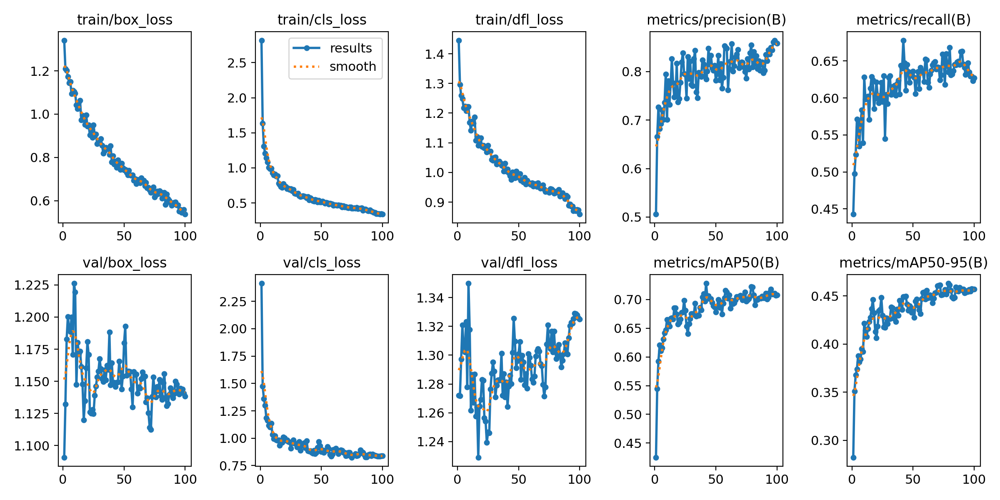
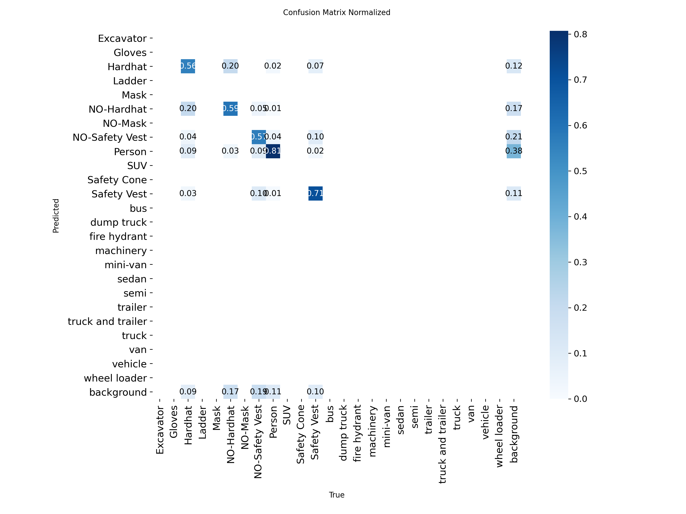

# safety-gear-detector
An end-to-end computer vision project for real-time PPE and workplace safety gear detection using YOLOv8, SQLite, and Streamlit.
## Model weights
Trained YOLOv8s weights (`best.pt`, 22 MB): [Download from Google Drive](https://drive.google.com/file/d/1wwpc7bypzXJOx8rI73FyXmN6s3mdLMMM/view?usp=sharing)

## Results (test set, 82 images)
| Class | Precision | Recall | mAP50 |
|---|---|---|---|
| Hardhat | 1.00 | 0.67 | 0.80 |
| Safety Vest | 0.86 | 0.71 | 0.79 |
| Person | 0.86 | 0.63 | 0.76 |
| NO-Safety Vest | 0.85 | 0.52 | 0.61 |
| NO-Hardhat | 0.67 | 0.49 | 0.46 |
| **All** | **0.85** | **0.60** | **0.68** |

